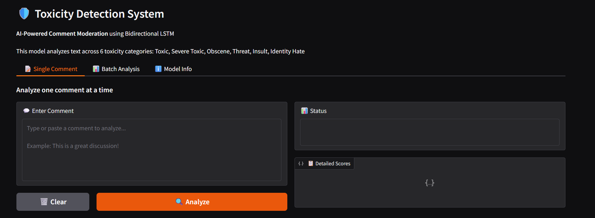
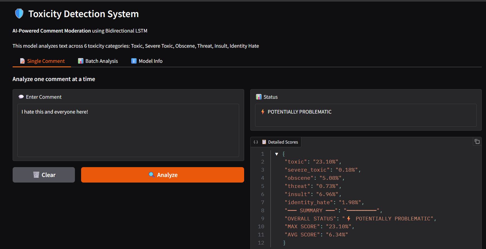
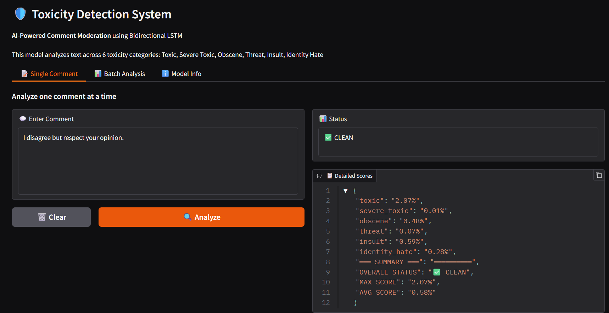
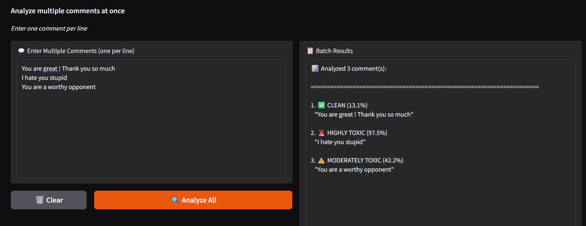

# ToxiShield — Cyberbullying & Toxic Comment Detector

A machine learning project for detecting toxic and harmful comments using a TensorFlow-based Bidirectional LSTM model, trained on the [Jigsaw Toxic Comment Classification Challenge](https://www.kaggle.com/datasets/julian3833/jigsaw-toxic-comment-classification-challenge) dataset.

## Overview

This project analyzes textual comments and classifies them across six toxicity categories:

- **Toxic**
- **Severe Toxic**
- **Obscene**
- **Threat**
- **Insult**
- **Identity Hate**

A comment can belong to more than one category at once — this is a multi-label classification problem, not a single-class one.

It includes:

- Dataset loading and exploration
- Text preprocessing and vectorization
- Bidirectional LSTM deep learning model training
- Evaluation and visualization
- An interactive Gradio interface for single-comment and batch testing

## Project Files

- `CYBER_BULLYING_DETECTION.ipynb` — main notebook containing data exploration, model building, training, and the Gradio demo
- `train1.csv` — training dataset with comments and their toxicity labels

## Dataset

Sourced from the Jigsaw Toxic Comment Classification Challenge, containing Wikipedia talk-page comments labeled by human raters.

| Column | Description |
|---|---|
| `id` | Unique comment identifier |
| `comment_text` | The raw comment text |
| `toxic`, `severe_toxic`, `obscene`, `threat`, `insult`, `identity_hate` | Binary (0/1) labels — a comment may have multiple labels set |

> **Note:** Only the training data is used for training. See the [dataset page](https://www.kaggle.com/datasets/julian3833/jigsaw-toxic-comment-classification-challenge) for the full file list.

## Requirements

Install the following Python packages before running the notebook:

```bash
pip install pandas numpy matplotlib tensorflow gradio
```

Optional, for local notebook environments:

```bash
pip install jupyter
```

## Setup

1. Download the training dataset from the [Kaggle dataset page](https://www.kaggle.com/datasets/julian3833/jigsaw-toxic-comment-classification-challenge) and place it in the project folder.
2. Open the project folder.
3. Start Jupyter Notebook, VS Code, or Google Colab.
4. Open `CYBER_BULLYING_DETECTION.ipynb`.
5. Run the cells in order.

## How It Works

1. Load the dataset from `train1.csv`.
2. Explore the dataset — class distribution across all six toxicity categories.
3. Transform comment text using `TextVectorization`.
4. Train a Bidirectional LSTM model with a 6-unit sigmoid output layer for multi-label classification.
5. Evaluate accuracy and loss, and plot training curves.
6. Score sample comments individually.
7. Launch the Gradio interface to test new comments interactively.

## Model Architecture

### Architecture

- **Type:** Bidirectional LSTM Neural Network
- **Embedding Dimension:** 32
- **LSTM Units:** 32 (bidirectional)
- **Dense Layer:** 128 units with ReLU
- **Output Layer:** 6 units with sigmoid

### Training Configuration

- **Vocabulary Size:** 20,000 tokens
- **Max Sequence Length:** 1,800 tokens
- **Optimizer:** Adam
- **Loss Function:** Binary Crossentropy
- **Test Accuracy:** 99.41%

### Toxicity Categories (6 types)

1. **Toxic** - General toxicity or rudeness
2. **Severe Toxic** - Extremely toxic or hateful content
3. **Obscene** - Profanity or vulgar language
4. **Threat** - Threatening or intimidating language
5. **Insult** - Insulting or degrading language
6. **Identity Hate** - Hate speech targeting identity groups

### Score Interpretation

| Score Range | Status | Description |
|---|---|---|
| 0-20% | ✅ Clean | Content is appropriate and non-toxic |
| 20-40% | ⚡ Potentially Problematic | May contain borderline content |
| 40-70% | ⚠️ Moderately Toxic | Contains toxic elements |
| 70-100% | 🚨 Highly Toxic | Severely toxic or harmful content |

## Gradio Demo

The final notebook cell launches a Gradio web interface with three tabs:

- **Single Comment** — enter one comment and get a status verdict plus a breakdown of scores across all six toxicity categories
- **Batch Analysis** — paste multiple comments (one per line) and get a summary verdict for each
- **Model Info** — architecture details, training configuration, and a score-interpretation reference table

Run the last notebook cell to launch it locally (`demo.launch()`). No data is stored or transmitted externally — everything runs in-session.

## Screenshots

### Image 1



### Image 2



### Image 3



### Image 4



## Notes

- The notebook is written for Google Colab-style file upload workflows; for local execution, update the dataset loading cell to point to your local `train1.csv` path.
- Class imbalance is significant — `severe_toxic`, `threat`, and `identity_hate` have far fewer examples than `toxic`, `obscene`, and `insult`. Accuracy alone can be misleading; consider per-class precision/recall when extending this project.

## Future Improvements

- Add class-weighting or resampling to address label imbalance
- Improve preprocessing with text cleaning and stopword handling
- Explore transformer-based models such as BERT
- Add per-class validation metrics (precision, recall, F1, confusion matrices)
- Deploy as a hosted web app or API

## License

This project is intended for academic and learning purposes. The dataset is released under CC0 by the original Kaggle uploader; underlying comment text is governed by Wikipedia's CC-BY-SA.
